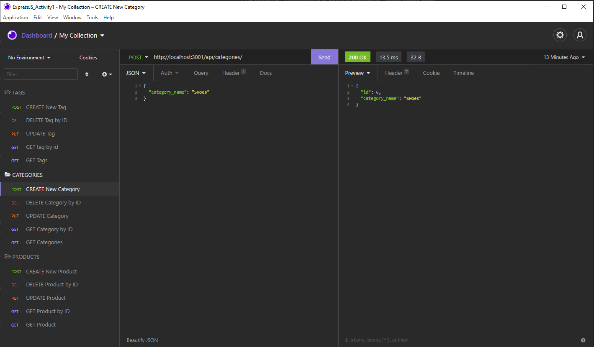

# Homework13-E-CommerceBackEnd
Homework 13 Object-Relational Mapping (ORM): E-Commerce Back End

## Contents
- [Description](#Description)
- [Screenshot](Screenshot)
- [Installation](#Installation)
- [Instructions](#Instructions)
- [Liscence](#Liscence)
- [Contributors](#Contributors)
- [Contacts](#Contacts)
- [GitHub Repository Link](#GitHubRepositoryLink)
- [Video Recording Link](#VideoRecordingLink)

## Description:
    This repository holds the back-end code for an ecommerce website and utilizes an Express.JS API, Sequelize npm package and MySQL database. Note that this repository does not have a front end and that walkthrough videos are available at the bottom of this README file.

    This backend repository allows for get all, get by Id, Update by Id, Create, and Delete by Id requests for three different models. The models include product, tag, and category.

## Screenshot:
    This screenshot shows the routes for the E-Commerce back end project.

## Installation
    1. Install mysql.
    2. Install the following NPM packages: Express, Sequelize and dotenv.
    3. Run the schema.sql file to create the database.
    4. Run 'npm run seed' in terminal to seed database.
    5. Start server.

## Instructions
    N/A. Only backend code available here.
    
## Liscense
    MIT

## Contributors
    Calvin Swomley

## Contact:
calvinswomley@gmail.com | [https://github.com/calvinswomley](https://github.com/calvinswomley)

## GitHub Repository Link
[https://github.com/calvinswomley/Homework13-E-CommerceBackEnd](https://github.com/calvinswomley/Homework13-E-CommerceBackEnd)

## Video Recording Link
Video 1: https://watch.screencastify.com/v/GBypU230znhmCd17vFeI
Video 2: https://watch.screencastify.com/v/1D3jlgbfhw64sEUY4dfT